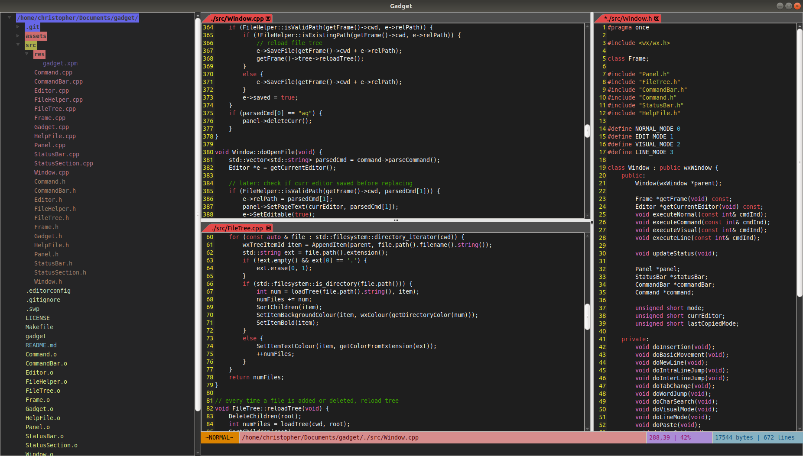

<h1 align="center">
    
</h1>

<h4 align="center">
    <b> A no-hassle GVim-inspired GUI text editor. </b>
</h4>

<p align="center">
    <a href="https://www.travis-ci.com/lintopher0315/gadget">
        
    </a>
    <a href="https://opensource.org/licenses/MIT">
        
    </a>
</p>

<p align="center">
    
</p>

## Installation

### Linux

#### Debian-based distros

Install via the latest corresponding Debian package:

```
curl -L -O https://github.com/lintopher0315/gadget/releases/download/v1.0.0/gadget_1.0.0_amd64.deb
sudo apt install ./gadget_1.0.0_amd64.deb
```

Alternatively, navigate to https://github.com/lintopher0315/gadget/releases/, download the Debian package manually, and then run `sudo apt install ./gadget_1.0.0_amd64.deb`.

## Features
* One-to-one functionality of numerous Vim commands
* 4 editor modes: *Normal*, *Edit*, *Visual*, and *Line*
    * Similar to Vim, *Visual* mode can be activated by clicking and dragging with the mouse
    * Allows CTRL-C and CTRL-V to/from clipboard in *Visual* and *Line* modes
* Minimalistic status bar
    * Displays unsaved and read-only files
    * Shows caret position and size of file by bytes and lines
* Smart indentation
* Color-coded file tree
    * Sorted by directories, dotfiles, then regular files by extension
    * Directories colored according to amount of files: pink if empty, red if <10, yellow if <30, green if <50, blue if <70, and purple for any higher quantity
* Tab splitting
* Syntax highlighting (only for C++ for now, work in progress)
* Soon-to-be cross-platform (also work in progress)

## Usage

After installing, run the following command to open Gadget:

```
gadget &
```

Gadget will open up in *Normal* mode which is the main mode for running commands for moving, editing, configuring, etc. Directly typing in *Normal* mode will begin forming a command underneath the status bar. Pressing `ESC` will clear the command bar. `ESC` will also switch from any other mode to *Normal* mode.

| *Normal* mode commands | Behavior |
| -------------------- | -------- |
| `[num]h` | move caret left `[num]` times |
| `[num]j` | move caret down `[num]` times |
| `[num]k` | move caret up `[num]` times |
| `[num]l` | move caret right `[num]` times |
| `[num]w` | jump to the start of the next word `[num]` times |
| `[num]b` | jump to the start of the previous word `[num]` times |
| `gg` | jump to the beginning of the file |
| `G` | jump to the end of the file |
| `[num]G` | jump to the beginning of line `[num]` |
| `_` | jump to the first non-whitespace character of the current line |
| `0` | jump to the beginning of the current line |
| `$` | jump to the end of the current line |
| `[num]x` | cut the character the caret is currently on `[num]` times |
| `[num]o` | append `[num]` empty lines below the current line |
| `[num]O` | append `[num]` empty lines above the current line |
| `[num]dd` | cut `[num]` lines |
| `D` | cut to the end of the current line |
| `f [char]` | jump to the next instance of `[char]` on the current line |
| `F [char]` | jump to the previous instance of `[char]` on the current line |
| `t [char]` | jump just before the next instance of `[char]` on the current line |
| `T [char]` | jump just after the previous instance of `[char]` on the current line |
| `p` | past the contents of the clipboard after the caret |
| `P` | past the contents of the clipboard before the caret |
| `[num]gt` | switch to the tab indicated by `[num]` |
| `i` | change to *Edit* mode
| `I` | change to *Edit* mode and jump before the first non-whitespace character of the current line |
| `a` | change to *Edit* mode and move the caret right |
| `A` | change to *Edit* mode and jump to the end of the current line |
| `v` | switch to *Visual* mode |
| `V` | switch to *Line* mode |
| `:q` | quit and close the current document |
| `:w` | save the document to the file it points to |
| `:w [file]` | save the document to `[file]` and set it to point to `[file]` |
| `:wq` | save and close the document |
| `:e [file]` | open a new file, `[file]`, in the current editor |
| `:tabedit` | create a new empty document in another tab |
| `:tabedit [file]` | create a new document in another tab pointing to `[file]`
| `:split` | split the current tab horizontally |
| `:vsplit` | split the current tab vertically |
| `:help` | open the help file in a new tab |

*Edit* mode is for writing and acts as any standard text editor. *Edit* mode has no commands.

*Visual* mode allows the performing of actions on blocks of text like copying, pasting, case-changing, etc. Once in visual mode, the anchor of the selection will begin from where the caret is positioned. All movement commands seen in *Normal* mode (e.g. `hjkl`, `gg`, `w`, etc.) can be used to extend the selection.

| *Visual* mode commands | Behavior |
| -------------------- | -------- |
| `x` | cuts the selection |
| `u` | changes selection to lowercase |
| `U` | changes selection to uppercase |
| `y` | copies selection to the clipboard |

*Line* mode is similar to visual mode, but differs in that it only extends the selection line-by-line. This is useful for selecting blocks of text where only the lines matter. All *Visual* commands will also work in *Line* mode as well as *Normal* mode movement commands.

| *Line* mode commands | Behavior |
| -------------------- | -------- |
| `[num]<` | shifts the selected lines `[num]` times to the left |
| `[num]>` | shifts the selected lines `[num]` times to the right |